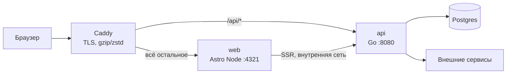
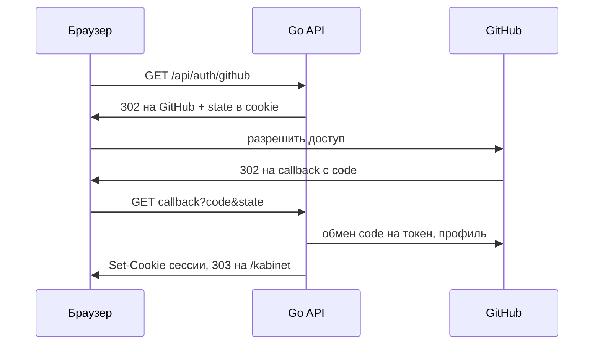
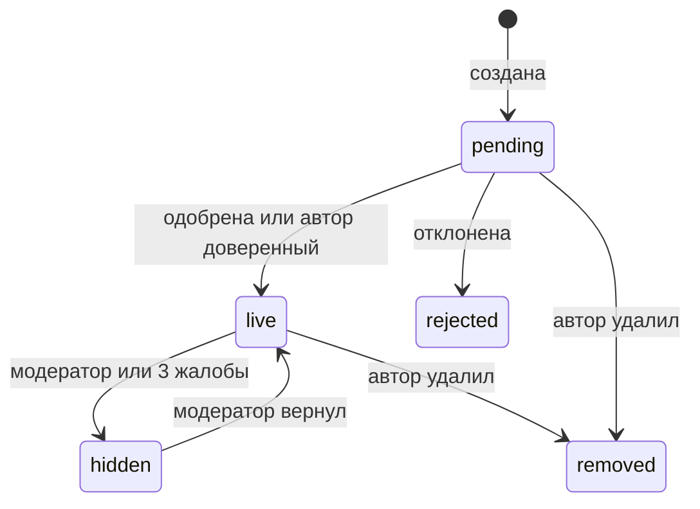
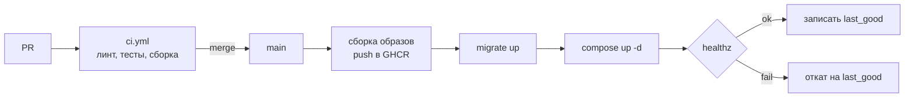

# beda.giglabo.com — как и что делаем

23 сентября 2026 · Денис

Живая версия документа: https://claude.ai/code/artifact/764f380b-c599-4791-b2b6-23a497420d2d — если правили там, актуальнее она.

**Действуют поправки П-1 (Supabase остаётся) и П-2 (бэкенд на Rust)** — см. `08-amendments.md`. Они имеют приоритет над разделами ниже.

## Решения и допущения

Делаем Astro (SSR на Node) + Go API + свой Postgres в одном публичном монорепо `beda-giglabo`. Хостинг — один VPS с Docker Compose за Caddy, домен `beda.giglabo.com`, деплой из GitHub Actions на каждый merge в `main`.

| Область | Решение | Почему |
| --- | --- | --- |
| Фронт | Astro, адаптер `@astrojs/node` (standalone), острова на Preact | контентный сайт с островами интерактива; статика по умолчанию, SSR только для UGC и личного |
| Бэк | Go, один бинарник `beda-api` (API, миграции, фоновые задачи) | бэкенд живёт в монорепо, один процесс проще деплоить и отлаживать |
| База | Postgres, актуальная мажорная версия, `pgx` + `sqlc`, миграции `goose` | нормальный SQL, данные под нашим контролем, регион хостинга — наш выбор |
| Авторизация | своя: GitHub OAuth + magic link, сессии в Postgres, HttpOnly-cookie | фронт и API на одном домене, JWT не нужен |
| Контракт API | OpenAPI в `packages/api-contract` → Go-интерфейсы (`oapi-codegen`) и TS-клиент (`openapi-typescript`) | фронт и бэк не расходятся молча |
| UGC | только текст, одна ссылка на проект, премодерация первых записей | снимает авторские права на картинки, спам и хранение файлов |
| Хостинг | один VPS, Docker Compose, Caddy с авто-TLS | дёшево, предсказуемо, переносимо в любой регион |
| CI/CD | GitHub Actions, образы в GHCR, деплой по SSH | всё в том же репозитории, публично видно |

Что сознательно не берём на старте: Supabase (есть свой бэкенд и своя база), Kubernetes, отдельный staging, CDN, Realtime. Каждое можно добавить позже без переписывания.

Допущения: репозиторий публичный на GitHub; DNS зоны `giglabo.com` под нашим управлением; одна инстанция API (это важно для rate limit и планировщика, см. разделы 5 и 8); контент по-русски, английская версия позже.

## Архитектура

Всё отдаётся с одного адреса `beda.giglabo.com`: Caddy отправляет `/api/*` в Go, остальное — в Astro. Один домен значит общая cookie сессии, никакого CORS и один TLS-сертификат.



Astro при рендере на сервере ходит в Go по внутренней сети `http://api:8080` и пробрасывает cookie пользователя — так server islands получают персональные данные. Postgres наружу не смотрит, порты 80 и 443 открыты только у Caddy.

| Тип запроса | Кто обрабатывает | Кеш |
| --- | --- | --- |
| Статические страницы, ассеты | Astro (файлы из сборки) | `immutable` для ассетов с хешем, короткий для HTML |
| UGC-страницы и хабы | Astro SSR → Go API | `s-maxage` + `stale-while-revalidate`, готово для CDN |
| Server islands (счётчики, «ты уже…») | Astro SSR → Go API | `private, no-store` |
| Запись (формы, острова) | Go напрямую через `/api/*` | не кешируется |
| OG-картинки | Astro: заранее при сборке или эндпоинт | `immutable`, версия в адресе |
| Вебхуки (Telegram) | Go | — |

Внешние сервисы Go: GitHub OAuth, SMTP-провайдер для magic link, Cloudflare Turnstile, Telegram Bot API, IndexNow. Всё за интерфейсами, чтобы провайдера можно было заменить, а в разработке — подменить заглушкой.

## Монорепо beda-giglabo

TypeScript-часть управляется pnpm workspaces + Turborepo, Go — одним модулем в `apps/api`, а общие команды для обоих миров — через `Taskfile.yml` в корне.

```
beda-giglabo/
├── apps/
│   ├── web/                 Astro: страницы, острова, эндпоинты OG и sitemap
│   └── api/                 Go: cmd/beda-api, internal/…, go.mod
├── packages/
│   ├── core/                чистая TS-логика: квиз, поиск слов, «Шторм», кодек результата
│   ├── transom/             компонент транца: CSS, MOUNTS, SSR-разметка + гидрация
│   ├── yacht-3d/            three.js: яхта и анимация букв (порт src/ и стенда)
│   ├── tokens/              дизайн-токены (CSS-переменные), шрифты
│   └── api-contract/        openapi.yaml + сгенерированный TS-клиент
├── db/
│   ├── migrations/          SQL-миграции goose (единственный источник схемы)
│   └── queries/             SQL для sqlc
├── deploy/
│   ├── compose.yaml         prod: caddy, web, api, postgres, backup
│   ├── compose.dev.yaml     dev: postgres, mailpit
│   ├── Caddyfile
│   └── scripts/             deploy.sh, backup.sh, restore.sh
├── docs/                    техдоки (из архива) + ADR
├── archive/                 прототипы: src/*.html, site/, design/
├── .github/                 workflows, dependabot.yml, CODEOWNERS, шаблоны PR и issue
├── Taskfile.yml
├── pnpm-workspace.yaml
├── turbo.json
└── .node-version, .editorconfig, LICENSE, README.md
```

| Инструмент | Роль |
| --- | --- |
| pnpm workspaces | зависимости TS-пакетов, версия фиксируется в `packageManager` |
| Turborepo | кеш и порядок задач `build`, `test`, `lint`, `typecheck` |
| Taskfile | единые команды: `task dev`, `task test`, `task gen`, `task migrate:new` |
| Biome | линт и формат TS/JSON/CSS одним инструментом |
| golangci-lint | линт Go, включая `staticcheck`, `errcheck`, `gosec` |
| Vitest | тесты `packages/core`, `packages/transom` |
| Playwright | сквозные сценарии: квиз, вход, публикация эпитафии |

Соглашения:

- Conventional Commits, squash-merge в `main`, `main` всегда деплоится.
- Генерация (`sqlc`, `oapi-codegen`, TS-клиент) — коммитится в репозиторий; CI проверяет, что после `task gen` нет диффа.
- Решения, которые трудно откатить, записываются коротким ADR в `docs/adr/`.
- Язык интерфейса по умолчанию — русский, все строки через словари, даже пока язык один.

## Фронт на Astro

Страницы пререндерятся по умолчанию; на рендер по запросу переводятся только UGC, личные и служебные маршруты через `export const prerender = false`. Персональное внутри кешируемых страниц — через server islands (`server:defer`).

| Маршрут | Рендер | Индекс | Что там |
| --- | --- | --- | --- |
| `/` | статика | да | главная из прототипа |
| `/osmotr` | статика + остров | да | квиз |
| `/osmotr/r/[code]` | SSR | нет | результат для шеринга, OG-картинка |
| `/kak-nazovesh` | статика + остров | да | игра с названием |
| `/bukvy/[slug]` | статика | да | шесть статей-столпов: `p-pozicionirovanie` и т. д. |
| `/moya-yahta` | SSR | нет | трекер (гость — из localStorage, вошедший — с сервера) |
| `/gavan`, `/gavan/page/[n]` | SSR, кеш | да | реестр |
| `/gavan/[id]-[slug]` | SSR, кеш | по порогу | яхта |
| `/gavan/bukva/[l]` | SSR, кеш | от 5 записей | хаб |
| `/treugolnik`, `/treugolnik/page/[n]` | SSR, кеш | да | эпитафии |
| `/treugolnik/[id]-[slug]` | SSR, кеш | по порогу | эпитафия |
| `/treugolnik/bukva/[l]`, `/prichina/[c]`, `/god/[y]` | SSR, кеш | от 5 записей | хабы |
| `/zhurnal`, `/zhurnal/[nedelya]` | SSR, кеш | да | журнал автора |
| `/kalkulyator`, `/shtorm` | статика + остров | да | игрушки |
| `/voiti`, `/kabinet` | SSR | нет | вход, профиль, мои записи |
| `/admin/*` | SSR | нет | модерация, только роль moderator |
| `/pravila`, `/konfidencialnost` | статика | да | правила и политика |
| `/sitemap-index.xml`, `/sitemap-ugc.xml` | SSR, кеш | — | карты сайта |
| `/og/...` | статика или SSR | — | картинки для шеринга |

Острова и как они грузятся:

- Квиз, «Как назовёшь», калькулятор, «Шторм» — `client:visible`, логика из `packages/core`.
- Трекер — `client:load`: это основное содержимое страницы.
- Кнопки «бросить круг», «поднять», «пожаловаться» — маленький остров поверх обычной `<form>`: без JS форма работает как POST с редиректом.
- 3D-сцена — `client:idle` и только на странице, где она есть; первый экран всегда рисует CSS-транец, 3D подменяет его после загрузки.

Компонент транца (`packages/transom`): на сервере отдаёт готовую разметку с состоянием букв (без JS всё видно и индексируется), в браузере тот же класс берёт разметку под управление и анимирует. `MOUNTS` и углы виса — данные в пакете, одинаковые для 2D и 3D.

Прочее: шрифты самохостим (Playfair Display, IBM Plex Sans и Mono, только нужные начертания и кириллица + латиница); i18n — встроенный роутинг Astro, `ru` в корне, `en` позже под `/en`; бюджет JS на главной без 3D — до 50 КБ gzip.

## Бэк на Go

Один бинарник `beda-api` с подкомандами: `serve` (HTTP + фоновые задачи), `migrate up|down|status` (миграции встроены через `go:embed`) и `admin` (служебные команды, например выдать роль модератора). Роутер — стандартный `net/http.ServeMux` с методами и шаблонами путей, без фреймворка.

```
apps/api/
├── cmd/beda-api/            main, подкоманды
└── internal/
    ├── platform/            конфиг из env, slog, graceful shutdown
    ├── httpx/               middleware, ошибки, JSON/форма, редиректы
    ├── auth/                OAuth GitHub, magic link, сессии, роли
    ├── ugc/                 эпитафии, яхты, круги, «поднять», жалобы
    ├── moderation/          очередь, решения, журнал модерации
    ├── tracker/             гвозди, импорт из localStorage
    ├── seo/                 slug, порог индексации, sitemap, IndexNow
    ├── notify/              почта, Telegram
    ├── jobs/                outbox, планировщик, ретраи
    ├── antiabuse/           Turnstile, rate limit, стоп-лист, ссылки
    └── store/               сгенерированный sqlc-код + транзакции
```

Цепочка middleware, по порядку: request id → логирование → recover → лимит тела запроса (64 КБ) → загрузка сессии → проверка Origin для небезопасных методов → rate limit → хендлер.

| Метод и путь | Что делает | Доступ |
| --- | --- | --- |
| `GET /api/healthz`, `/api/readyz` | живость, готовность (с проверкой базы) | все |
| `GET /api/auth/github`, `/api/auth/github/callback` | вход через GitHub | все |
| `POST /api/auth/magic`, `GET /api/auth/magic/[token]` | ссылка на почту и вход по ней | все |
| `POST /api/auth/logout`, `GET /api/me` | выход, текущий пользователь | вошедший |
| `POST /api/quiz/attempts` | анонимная запись прохождения для статистики | все |
| `GET/PUT /api/tracker`, `POST /api/tracker/import` | состояние гвоздей, перенос из браузера | вошедший |
| `GET /api/wrecks`, `/api/wrecks/[id]`, `/api/wrecks/hubs/...` | чтение эпитафий и хабов (только live) | все |
| `POST /api/wrecks`, `PATCH/DELETE /api/wrecks/[id]` | создать, править (пока pending), удалить своё | вошедший |
| `POST /api/wrecks/[id]/raise` | «поднять со дна» | вошедший |
| `GET/POST /api/yachts...` | то же для реестра | как выше |
| `POST /api/yachts/[id]/lifebuoys`, `/pins`, `/tows`, `/tried` | круг, прибить букву, буксир, «попробовал» | вошедший |
| `POST /api/reports` | жалоба на любую запись | вошедший |
| `GET /api/admin/queue`, `POST /api/admin/decisions` | очередь модерации, решения | moderator |
| `GET /api/sitemap/ugc` | данные для sitemap: адрес + `lastmod` | все |
| `POST /api/telegram/webhook` | вебхук бота, проверка секретного заголовка | Telegram |

Один хендлер понимает и форму, и JSON: пришла `application/x-www-form-urlencoded` — после действия ответ `303` на страницу; пришёл JSON — JSON. Так формы работают без JS, а острова — без перезагрузки.

**Побочные эффекты — через outbox.** Смена статуса записи в той же транзакции кладёт задачи в таблицу `jobs`: сбросить кеш, пингнуть IndexNow, отправить уведомление. Воркеры внутри `serve` забирают их через `FOR UPDATE SKIP LOCKED` и повторяют с экспоненциальной задержкой. Ни одно уведомление не теряется, если внешний сервис лежал.

**Планировщик** — тоже внутри `serve`, под `pg_try_advisory_lock`, чтобы задачи не задвоились, если когда-нибудь инстанций станет две:

| Задача | Когда |
| --- | --- |
| Ржавчина гвоздей О и Д | раз в сутки, 04:00 UTC |
| Напоминания в Telegram | раз в сутки, 09:00 по Москве |
| Очистка просроченных сессий и magic link | раз в час |
| Пересчёт готовности хабов к индексации | раз в час |

Сброс кеша — интерфейс `cache.Purger` с реализацией-заглушкой на старте: пока CDN нет, кешировать нечего, но все вызовы уже на месте.

## База данных

Схема живёт только в `db/migrations` (SQL для goose), запросы — в `db/queries` для sqlc. Права проверяет Go; база держит целостность: уникальности, лимиты длины, статусы и счётчики через триггеры.

| Таблица | Назначение | Ключевые поля и ограничения |
| --- | --- | --- |
| `users` | пользователи | `id uuid`, `display_name`, `role` (user / moderator / admin), `trusted bool`, `created_at` |
| `identities` | привязки входа | `provider` (github / email), `subject`, `email`; уникально (`provider`, `subject`) |
| `sessions` | сессии | `token_hash bytea` уникально, `user_id`, `expires_at`, `last_seen_at`, `ip_hash`, `ua` |
| `magic_links` | ссылки на вход | `token_hash`, `email`, `expires_at` (15 мин), `used_at` |
| `tracker_nails` | гвозди трекера | (`user_id`, `letter`) PK, `count 0..4`, `proof_urls text[]`, `updated_at` |
| `wrecks` | эпитафии | `id`, `slug`, `author_id`, `anonymous`, `name ≤ 80`, `years`, `tagline ≤ 140`, `cause` (enum), `first_letter`, `epitaph ≤ 140`, `story ≤ 2000`, `url`, `status`, `index_ready`, `raises_count`, `reports_count`, `published_at`, `updated_at` |
| `raises` | «поднять со дна» | уникально (`wreck_id`, `user_id`), `message ≤ 280` |
| `yachts` | реестр | как `wrecks` + `help_wanted text[]`, `lifebuoys_count`, `pins_count` |
| `lifebuoys` | круги | уникально (`yacht_id`, `from_user`), `text ≤ 280`, `hidden` |
| `letter_pins`, `tows`, `tried` | прибить букву, буксир, «попробовал» | уникально на пару запись + пользователь |
| `reports` | жалобы | `target_type`, `target_id`, `from_user`, `reason`; уникально на тройку |
| `moderation_log` | журнал решений | кто, что, когда, было → стало, причина |
| `quiz_attempts` | анонимная статистика | `scores smallint[6]`, `class`, `shared`, `source`, `created_at` |
| `events` | продуктовые события | `name`, `user_id?`, `anon_id?`, `props jsonb`, `created_at` |
| `telegram_links` | привязка бота | `user_id`, `chat_id`, `link_code`, `linked_at` |
| `jobs` | outbox | `kind`, `payload jsonb`, `run_at`, `attempts`, `last_error`, `done_at` |

Статусы записи (`wrecks`, `yachts`) — enum `pending`, `live`, `rejected`, `hidden`, `removed`.

Триггеры:

- счётчики `raises_count`, `lifebuoys_count`, `pins_count`, `reports_count` — на вставку и удаление в дочерних таблицах, без `count(*)` на чтении;
- авто-скрытие: `reports_count` от трёх разных аккаунтов старше 7 дней → `status = hidden` + запись в `moderation_log`;
- `index_ready` пересчитывается при изменении записи или её счётчиков (правило — в разделе про SEO);
- любая смена `status` или контента `live`-записи → задачи в `jobs`: сброс кеша, IndexNow, уведомление автору;
- `updated_at` на всех изменяемых таблицах.

Миграции: только вперёд в проде; каждая проверяется в CI на `up → down → up` на пустой базе. Опасные изменения — по схеме expand/contract: сначала добавляем новое и пишем в оба места, в следующем релизе удаляем старое. `rejected` и `removed` храним 30 дней, потом фоновая задача вычищает текст, оставляя строку для журнала.

## Авторизация и сессии

Вход — через GitHub или по ссылке на почту; после входа браузер получает одну HttpOnly-cookie, а сессия хранится в Postgres. Никаких JWT: API и сайт на одном домене, отзыв сессии — удаление строки.



| Параметр | Значение |
| --- | --- |
| GitHub OAuth | scope `read:user user:email`, берём только подтверждённый основной email; `state` — случайные 32 байта в короткой cookie, сверяются на callback |
| Magic link | токен 32 байта, в базе только SHA-256, живёт 15 минут, одноразовый; не больше 3 писем на адрес в час |
| Cookie | `__Host-beda_sid`, `HttpOnly`, `Secure`, `SameSite=Lax`, `Path=/` |
| Срок сессии | 30 дней, продлевается, если осталось меньше 15 и человек активен |
| Хранение | в базе SHA-256 от токена; утечка дампа не даёт войти |
| Выход | удаление строки сессии; «выйти везде» — удаление всех сессий пользователя |
| Роли | `user`, `moderator`, `admin` в `users.role`; первый админ — `beda-api admin promote <github-логин>` на сервере |

Защита от CSRF: `SameSite=Lax` плюс проверка заголовков `Origin` или `Sec-Fetch-Site` на всех небезопасных методах. Запрос не с нашего домена → `403`.

Склейка аккаунтов: если email из GitHub совпадает с уже существующим email-входом, привязываем к тому же пользователю — только когда GitHub подтвердил этот email.

Гость и трекер: без входа прогресс живёт в `localStorage`, как в прототипе. При первом входе остров один раз отправляет `POST /api/tracker/import`; сервер берёт максимум по каждой букве и дальше хранит сам.

## UGC

Публикуется только текст, первые записи нового аккаунта проходят премодерацию, дальше — постмодерация с жалобами и авто-скрытием. Каждая смена статуса попадает в журнал и запускает сброс кеша.



| Статус | Кто видит | HTTP | В sitemap |
| --- | --- | --- | --- |
| `pending` | автор и модераторы | 404 для остальных | нет |
| `live` | все | 200 | если `index_ready` |
| `rejected` | автор (с причиной) | 404 | нет |
| `hidden` | автор и модераторы | 410 | нет |
| `removed` | никто | 410 | нет |

Доверие: после двух одобренных записей `users.trusted = true`, дальше записи сразу `live`. Доверие снимается при первом скрытии за нарушение.

Лимиты и проверки (в Go, и где можно — ещё и в базе):

| Что | Правило |
| --- | --- |
| Новые записи | 3 в сутки на пользователя; не раньше чем через 10 минут после регистрации |
| Круги, «поднять», жалобы | 30 в сутки на пользователя; одна штука на пару запись + пользователь |
| Запросы без входа | 60 в минуту на IP к API |
| Длина | название ≤ 80, эпитафия и слоган ≤ 140, история ≤ 2000, круг ≤ 280 символов |
| Ссылки | одна на запись, только `https`, без коротышей и адресов по IP, домен не из блок-листа; наружу `rel="ugc nofollow noopener"` |
| Текст | ссылки внутри текста не становятся кликабельными; стоп-лист до сохранения; нормализация пробелов и невидимых символов |
| Бот-защита | Cloudflare Turnstile на каждой форме, которая пишет; проверка токена на сервере |

Rate limit на старте — в памяти процесса (`golang.org/x/time/rate`, ключ IP + пользователь). Это работает, пока инстанция одна; при второй переносим счётчики в Postgres.

Модерация (`/admin`): очередь `pending` по времени, жалобы с текстом, по каждой записи — одобрить, отклонить с причиной, скрыть, вернуть. Причины — фиксированный список (реклама, чужой проект, персональные данные, оскорбления, спам, другое) плюс свободный текст. Каждое решение → `moderation_log` и письмо автору.

Правила для людей (страница `/pravila`, коротко): только свои проекты, без чужих персональных данных, без рекламы услуг, без оскорблений. Автор удаляет свою запись в один клик, контакт для жалоб — на каждой странице записи.

## SEO и индексация

Индексируем хабы и содержательные записи, а короткие записи держим видимыми, но с `noindex`, пока в них не появится содержание. Так поисковик видит сайт как набор полезных подборок, а не тысячу тонких страниц.

Правило `index_ready` для записи (пересчитывает триггер):

- `status = live`, опубликована больше 24 часов назад;
- и одно из: история ≥ 300 символов, или есть хотя бы один круг / «поднять» / «попробовал».

Хаб индексируется, если в нём ≥ 5 записей с `index_ready`. Пороги — константы в `internal/seo`, пересматриваются раз в месяц по отчёту «Страницы» в Search Console.

| Что | Как делаем |
| --- | --- |
| Контент | весь текст записи — в HTML с сервера; server islands только для счётчиков и кнопок |
| Адреса | `/treugolnik/42-trekker-privychek`: id + транслит заголовка; сменился заголовок → 301 на новый slug; `canonical` всегда на основной адрес |
| Коды ответа | по таблице статусов из раздела про UGC: 404 и 410, никаких заглушек с 200 |
| Пагинация | настоящие адреса `/page/[n]`, `rel=canonical` на себя, ссылки «вперёд» и «назад» в HTML |
| Перелинковка | хабы → записи, запись → свои хабы и 4 «похожих суда» по той же букве или причине; хлебные крошки |
| Sitemap | индекс `/sitemap-index.xml` = статика от `@astrojs/sitemap` + `/sitemap-ugc.xml` из API; только `index_ready`, с `lastmod` |
| Быстрое оповещение | при `live` и при правке — IndexNow (Яндекс, Bing) через outbox; ключ-файл отдаётся из корня сайта |
| Кабинеты | Google Search Console и Яндекс.Вебмастер подключаются в первый день, sitemap отправляется туда |
| Дубли | результаты квиза, фильтры, сортировки, личные страницы — `noindex`; параметры сортировки — `canonical` на базовый адрес |
| robots.txt | закрыты `/api/`, `/admin/`, `/kabinet`, `/moya-yahta`; указан sitemap |
| Разметка | JSON-LD: `Article` для страниц букв и журнала, `BreadcrumbList` везде; для записей — `CreativeWork` с автором (или без, если анонимно) |
| Скорость | цели: LCP < 2,5 с, CLS < 0,1, INP < 200 мс на мобильном; CSS-транец как LCP, 3D после |
| Языки | пока только `ru`; при появлении `en` — `hreflang` в `<head>` и в sitemap |

Первые 10–15 эпитафий и 10 яхт заводим сами до публичного запуска — свои и знакомых, с полноценными историями. Пустой раздел не индексируется и никого не зовёт писать.

## Шеринг и OG-картинки

Картинки результата квиза рендерим заранее при сборке: у каждой буквы три состояния, всего 3⁶ = 729 вариантов, и каждый становится обычным статическим файлом. Картинки для эпитафий и яхт генерирует эндпоинт по запросу с версией в адресе.

| Что | Как |
| --- | --- |
| Код результата | шесть цифр 0–2 (0 — упала, 1 — висит, 2 — на месте): `/osmotr/r/002212` |
| Картинка результата | `/og/osmotr/002212.png`, 1200 × 630, собирается в `apps/web` скриптом на satori + resvg по макету ShareCard; ≈ 729 × 50 мс ≈ 40 с сборки |
| Картинка записи | `/og/treugolnik/[id]-[v].png`, где `v` = `updated_at` в секундах; эндпоинт рендерит и отдаёт `Cache-Control: immutable` |
| Мета-теги | `og:title`, `og:description`, `og:image` (+ размеры), `twitter:card=summary_large_image`, `og:locale=ru_RU` |
| Кнопки | «Скопировать ссылку», «Скачать картинку», нативный `navigator.share` на телефоне; отдельных виджетов соцсетей не ставим |
| Текст шеринга | «Прошёл осмотр судна: у меня \_\_БЕДА. А у тебя?» + ссылка на результат |

Повороты висящих и упавших букв в satori нужно проверить на первом же прототипе: если трансформации рисуются неточно, для картинок рисуем буквы готовыми SVG-фрагментами, а не CSS.

Страница результата `/osmotr/r/[code]` — `noindex`, но с полными OG-тегами; открывший видит чужой транец и кнопку «Проверить своё судно».

## Инфраструктура и хостинг

Один VPS на 2 vCPU, 4 ГБ RAM и 80 ГБ SSD с Docker Compose — этого с запасом хватит на первый год. Регион выбираем по открытому вопросу о персональных данных, остальное от региона не зависит.

| Сервис | Образ | Наружу | Заметки |
| --- | --- | --- | --- |
| `caddy` | официальный Caddy | 80, 443 | авто-TLS Let's Encrypt, HTTP/3, сжатие, заголовки безопасности |
| `web` | `ghcr.io/<owner>/beda-web:<sha>` | нет | Node LTS alpine, `node ./dist/server/entry.mjs` |
| `api` | `ghcr.io/<owner>/beda-api:<sha>` | нет | distroless static, один бинарник |
| `postgres` | официальный Postgres | нет | том `pgdata`, `shared_buffers` ≈ 1 ГБ |
| `backup` | маленький образ с `pg_dump` и `age` | нет | cron внутри контейнера, выгрузка в S3-совместимое хранилище |

```
# deploy/Caddyfile
beda.giglabo.com {
  encode zstd gzip
  header {
    Strict-Transport-Security "max-age=31536000; includeSubDomains"
    X-Content-Type-Options nosniff
    Referrer-Policy strict-origin-when-cross-origin
    Permissions-Policy "camera=(), microphone=(), geolocation=()"
  }
  handle /api/* {
    reverse_proxy api:8080
  }
  handle {
    reverse_proxy web:4321
  }
}
```

Content-Security-Policy задаёт Astro: он умеет считать хеши своих скриптов и стилей сам, в Caddy её не дублируем.

DNS: записи `A` и `AAAA` для `beda.giglabo.com` на адрес VPS; `CAA` на `letsencrypt.org`. Сервер: вход только по ключу, пользователь `deploy` без sudo, но в группе `docker`; firewall пропускает 22, 80, 443; автоматические обновления безопасности ОС.

Секреты лежат в `/opt/beda/.env` с правами `600`; при деплое их записывает workflow из секретов GitHub-окружения `production`. В репозитории — только `deploy/.env.example` с именами переменных.

Локальная разработка: `task dev` поднимает `compose.dev.yaml` (Postgres + Mailpit для писем), запускает миграции, Go с перезапуском по изменениям через `air` и `astro dev`. Вход в разработке — по magic link, письма видны в Mailpit на `localhost:8025`; GitHub OAuth — отдельное dev-приложение.

## CI/CD на GitHub Actions

Каждый PR проходит проверки без доступа к секретам; каждый merge в `main` собирает два образа, публикует их в GHCR и выкатывает на сервер с миграциями, проверкой здоровья и автоматическим откатом.



| Workflow | Когда | Что делает |
| --- | --- | --- |
| `ci.yml` | PR и push | web: `pnpm install --frozen-lockfile`, Biome, `astro check`, Vitest, `astro build`; api: `golangci-lint`, `go test -race` с Postgres в service-контейнере, `migrate up/down/up`; `task gen` без диффа |
| `e2e.yml` | push в `main`, по требованию | `compose` со всем стеком, Playwright: квиз → результат, вход по magic link через Mailpit, публикация эпитафии → модерация → страница `live` |
| `deploy.yml` | после зелёного `ci.yml` на `main` | сборка и push `beda-web` и `beda-api` с тегами `<sha>` и `main`, затем деплой в окружение `production` |
| `codeql.yml` | PR, push, раз в неделю | CodeQL для Go и JavaScript/TypeScript |
| `weekly.yml` | раз в неделю | проверка битых ссылок на проде, Lighthouse по главной и одной UGC-странице с бюджетом |
| Dependabot | раз в неделю | обновления npm, Go-модулей, Docker-образов и самих actions |

Деплой по шагам (`deploy/scripts/deploy.sh <sha>` на сервере):

1. `docker compose pull` образов с тегом `<sha>`.
2. `docker compose run --rm api migrate up` — если миграция упала, дальше не идём, старая версия продолжает работать.
3. `docker compose up -d web api`.
4. До 60 секунд опрашиваем `https://beda.giglabo.com/api/readyz` и главную страницу.
5. Успех → `<sha>` записывается в `/opt/beda/.last_good`. Провал → `up -d` с `last_good` и красный статус в Actions.

Откат не трогает базу, поэтому миграции обязаны быть обратно совместимыми с предыдущей версией кода (expand/contract из раздела про базу).

Доступ workflow к серверу: отдельный SSH-ключ в секрете окружения `production`; на сервере он в `authorized_keys` с `command="/opt/beda/deploy/scripts/deploy.sh"` и `restrict`, так что ключ умеет только запускать деплой. Это важно: участник группы `docker` на сервере фактически равен root. У `deploy.yml` — `concurrency: production`, чтобы два деплоя не шли одновременно.

## Безопасность публичного репозитория

В репозитории нет ни одного секрета, а код из чужих форков никогда не запускается с доступом к продакшену. Всё остальное — настройки GitHub, которые включаются один раз.

| Настройка | Значение |
| --- | --- |
| Защита `main` | только через PR, обязательные проверки `ci.yml` и CodeQL, линейная история, без force-push |
| CODEOWNERS | `/deploy/`, `/.github/`, `/db/migrations/` — только с ревью владельца |
| Окружение `production` | секреты деплоя только здесь; деплой разрешён только из `main`; по желанию — ручное подтверждение |
| Workflows | только событие `pull_request` (без секретов для форков), никогда `pull_request_target` с чекаутом кода PR; `permissions:` минимальные на каждый job |
| Actions | закреплены по SHA коммита, а не по тегу; Dependabot обновляет эти SHA |
| Одобрение запусков | для первых контрибьюторов из форков — ручное одобрение запуска workflow |
| Сканирование | secret scanning и push protection включены; CodeQL; Dependabot alerts |
| Образы | публичные в GHCR, собираются только в `deploy.yml`, без секретов внутри |
| Ключ деплоя | принудительная команда в `authorized_keys`; `deploy.sh` берёт `<sha>` из `SSH_ORIGINAL_COMMAND` и проверяет, что это 40 шестнадцатеричных символов |
| Лицензия | MIT для кода; тексты и дизайн — отдельной строкой в README, чтобы код можно было брать, а бренд — нет |

Что сознательно открыто: весь код, схема базы, конфигурация Caddy и compose, пайплайн. Это часть рубрики — build in public. Что никогда не попадает в репозиторий: `.env`, дампы базы, логи с IP и почтами, ключи OAuth и Turnstile.

## Наблюдаемость, аналитика, бэкапы

Логи — JSON через `slog` в Docker с ротацией; внешний пинг проверяет сайт каждую минуту; продуктовые метрики считаем сами из таблицы `events`, а посещаемость — Umami без cookie. Бэкап базы — каждую ночь, восстановление проверяем раз в месяц.

| Что | Как |
| --- | --- |
| Логи | `slog` JSON: request id, метод, путь, статус, длительность, `user_id`; IP только хешем; Docker `json-file` с `max-size=50m`, `max-file=5` |
| Доступность | внешний мониторинг `https://beda.giglabo.com/api/readyz` и главной раз в минуту, оповещение в Telegram |
| Ошибки | паники и 5xx — в лог с уровнем error; при необходимости подключается Sentry-совместимый сервис (например, GlitchTip) без изменений кода, через интерфейс |
| Посещаемость | Umami, self-hosted отдельным контейнером со своей базой в том же Postgres; без cookie — обычно это позволяет обойтись без баннера согласия для аналитики, но проверяется вместе с юридическим разделом |
| Продуктовые события | таблица `events`: `quiz_started`, `quiz_completed`, `result_shared`, `namer_played`, `tracker_nail`, `login`, `wreck_submitted`, `wreck_live`, `lifebuoy_thrown`, `raise_clicked`, `reminder_sent`, `reminder_clicked` |
| Отчёты | SQL-вью в базе: воронка «осмотр → трекер», возврат на 7-й и 30-й день, доля записей с хотя бы одним ответом за 7 дней |
| Бэкап | `pg_dump -Fc` каждую ночь в 03:00 UTC, шифрование `age`, выгрузка в S3-совместимое хранилище у другого провайдера |
| Хранение копий | 14 ежедневных, 8 еженедельных, 6 ежемесячных |
| Проверка восстановления | раз в месяц `restore.sh` поднимает последнюю копию во временный контейнер и прогоняет контрольные запросы (число записей, последняя дата) |

Главные метрики для рубрики — те, что в тактиках: доля дошедших до результата квиза, доля поделившихся, возврат в трекер, доля эпитафий, получивших ответ. Их можно показать в самом журнале автора: это готовый контент для build in public.

## Юридическое и правила

До запуска аккаунтов нужны три текста: правила публикации, политика конфиденциальности и условия использования с лицензией на пользовательский контент. Это не юридическая консультация — формулировки и вопрос о регионе хранения данных стоит проверить со специалистом.

| Вопрос | Что делаем |
| --- | --- |
| Какие персональные данные | email, имя или ник из GitHub, id GitHub, хеш IP в сессиях и логах; Telegram chat id, если человек привязал бота |
| Хранение данных | если аудитория в России и собираем email, первичная запись персональных данных — в базу на территории РФ; от этого зависит регион VPS (открытый вопрос) |
| Политика конфиденциальности | что собираем, зачем, сколько храним, как удалить аккаунт; ссылка в подвале и на странице входа |
| Лицензия на UGC | автор сохраняет права на свой текст и даёт сайту неисключительное право показывать его; при удалении записи показ прекращается |
| Удаление | запись — в один клик; аккаунт — из кабинета, с удалением сессий, привязок и анонимизацией записей в течение 30 дней |
| Жалобы и удаление по требованию | контакт на каждой странице записи и в правилах; срок реакции — 48 часов |
| Cookie | только необходимая cookie сессии и короткая cookie `state` для входа; аналитика без cookie |
| Бренд | в правилах и README: персонажи, цитаты и песни мультфильма не используются; яхта, стиль и тексты — свои |

## Этапы работ

Семь этапов, каждый заканчивается работающим продом на `beda.giglabo.com`. Оценки — для одного разработчика и очень грубые: самое непредсказуемое в каждом этапе — тексты, модерация и баланс, а не код.

| Этап | Что входит | Готово, когда | Оценка |
| --- | --- | --- | --- |
| 0. Фундамент | монорепо, Taskfile, CI, пустые `web` и `api` с `healthz`, VPS, Caddy, DNS, деплой с откатом, бэкапы | merge в `main` выкатывает «Hello» на `beda.giglabo.com` с TLS, откат проверен руками, первый бэкап восстановлен | 3–5 дней |
| 1. Статика и квиз | порт главной из прототипа, `packages/transom`, `packages/core`, шесть страниц букв, квиз, «Как назовёшь», 729 OG-картинок, sitemap, robots, Search Console и Вебмастер | Lighthouse ≥ 90 по всем пунктам на мобильном, страницы в индексе, ссылка на результат даёт правильное превью в Telegram | 1–2 недели |
| 2. Аккаунты и трекер | GitHub OAuth, magic link, сессии, `/kabinet`, трекер на сервере, импорт из браузера, `events`, Umami | Playwright: вход обоими способами, импорт гвоздей, выход везде; политика и правила опубликованы | 1–1,5 недели |
| 3. Треугольник | эпитафии, хабы, модерация, жалобы, авто-скрытие, `index_ready`, IndexNow, outbox, Turnstile, лимиты, OG записей | 15 засеянных эпитафий `live`, хабы в sitemap, спам-форма отбивается Turnstile и лимитами, скрытая запись отдаёт 410 и исчезает из sitemap | 2–3 недели |
| 4. Реестр | яхты, круги, прибить букву, буксир, «попробовал», уведомления автору | 10 засеянных яхт, полный цикл «опубликовал → получил круг → пришло уведомление» | 1,5–2 недели |
| 5. Возврат и игрушки | Telegram-бот, ржавчина, напоминания, журнал автора, калькулятор течи, «Шторм» с симуляцией баланса в тестах | напоминание приходит и возвращает на сайт; «Шторм» проходит 1 000 симуляций на стратегию с ожидаемым распределением исходов | 2–3 недели |
| 6. 3D | `packages/yacht-3d`: порт яхты и стенда анимации, интеграция по плану из архива, ленивая загрузка | 3D не ухудшает LCP главной, на слабом телефоне автоматически остаётся CSS-транец | 1–2 недели |

Порядок можно менять после этапа 1: если квиз хорошо расходится, раньше делаем 2 и 5 (возврат), если нет — 3 (контент для рубрики и поиска).

## Открытые вопросы

- [ ] Аудитория: только русскоязычная или сразу обе? От ответа зависят регион VPS, требование о хранении данных и порядок появления `/en`.
- [ ] Владелец репозитория на GitHub: личный аккаунт или организация `giglabo`? От этого зависят адреса образов в GHCR и настройки окружений.
- [ ] Провайдер VPS и S3-совместимого хранилища для бэкапов — после ответа про регион.
- [ ] SMTP-провайдер для magic link: нужен тот, у которого хорошая доставляемость на почтовые сервисы твоей аудитории.
- [ ] Нужен ли английский вариант домена или всё живёт на `beda.giglabo.com` с `/en`.
- [ ] Кто модерирует кроме тебя, и какой срок реакции на жалобы реально держать.
- [ ] Нужен ли отдельный staging (`staging.beda.giglabo.com`) с этапа 3, когда появится UGC.
